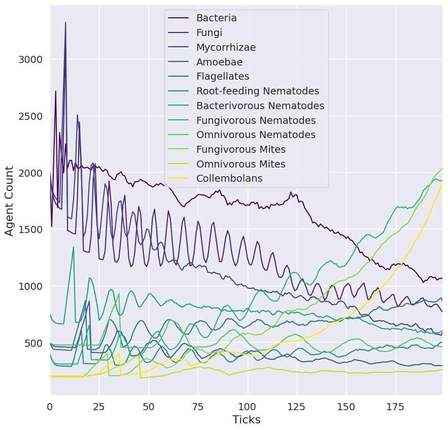

# Soil Simulator (SoSi)

## Install/Run instructions
Tested for Windows with WSL2 Ubuntu 22.04, and Python 3.10.7

1. Install MPI (in this case mpich, but openMPI should also work fine (not tested)): `sudo apt install mpich`
2. Install Python libraries `env CC=mpicxx pip install -r requirements.txt`
3. Run the model with `mpirun -n 1 python main.py full_run.yaml`, where `-n <#_processes` sets the number of processes that are used. 